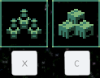

# Cargo and Merc Hotkeys

Adds hotkeys to the ship's cargo and mercenary buttons.

The keys can be configured and default to C for cargo and X for mercenaries.
The default for mercenaries is X due to the game using M for Map.

# Configuration

The configuration file will be created on the first game run and can be found at `%AppData%\..\LocalLow\Magnum Scriptum Ltd\Quasimorph\QM_CargoMercHotkeys\config.json`.

|Name|Default|Description|
|--|--|--|
|CargoKey|C|Opens the cargo screen|
|MercenariesKey|X|Opens the mercenaries screen|

## Key List
The list of valid keyboard keys can be found  at the bottom of https://docs.unity3d.com/ScriptReference/KeyCode.html
Beware that numbers 0-9 are Alpha0 - Alpha9.  Most of the other keys are as expected such as X for X.
Use "None" to not bind the key.

# Support
If you enjoy my mods and want to buy me a coffee, check out my [Ko-Fi](https://ko-fi.com/nbkredspy71915) page.
Thanks!

# Credits

Key icons from [Tanya Ferrera](https://pixabay.com/users/sthenostudio-875253/?utm_source=link-attribution&utm_medium=referral&utm_campaign=image&utm_content=1409743) at [Pixabay](https://pixabay.com//?utm_source=link-attribution&utm_medium=referral&utm_campaign=image&utm_content=1409743)

# Source Code
Source code is available on GitHub at https://github.com/NBKRedSpy/QM_CargoMercHotkeys

# Change Log 
## 1.1.0
* .8 compatibility.